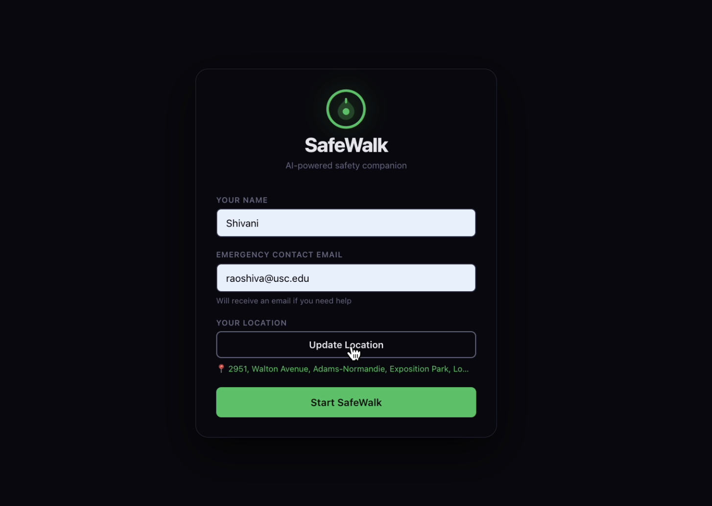
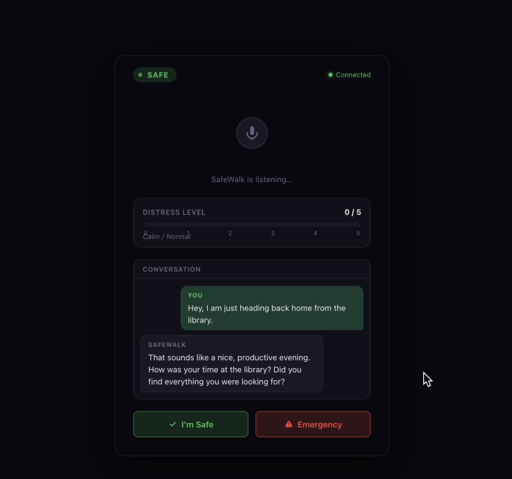
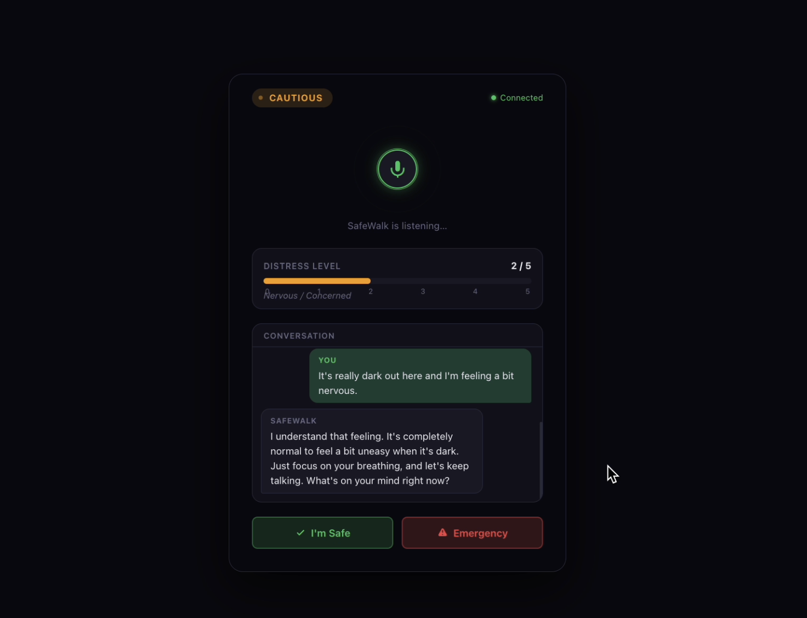
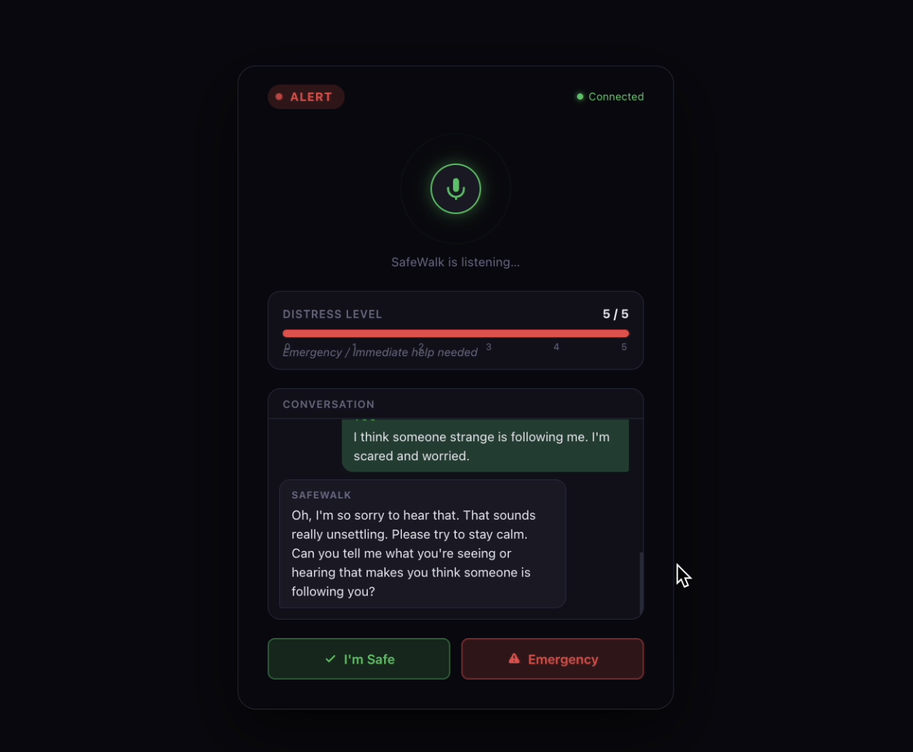
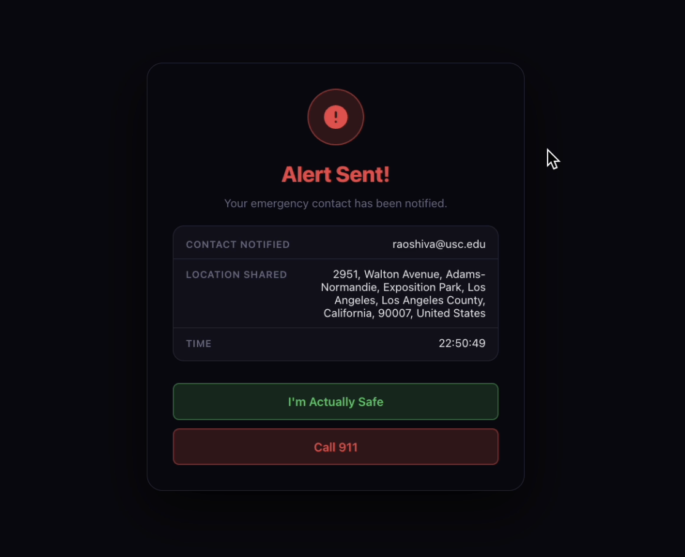
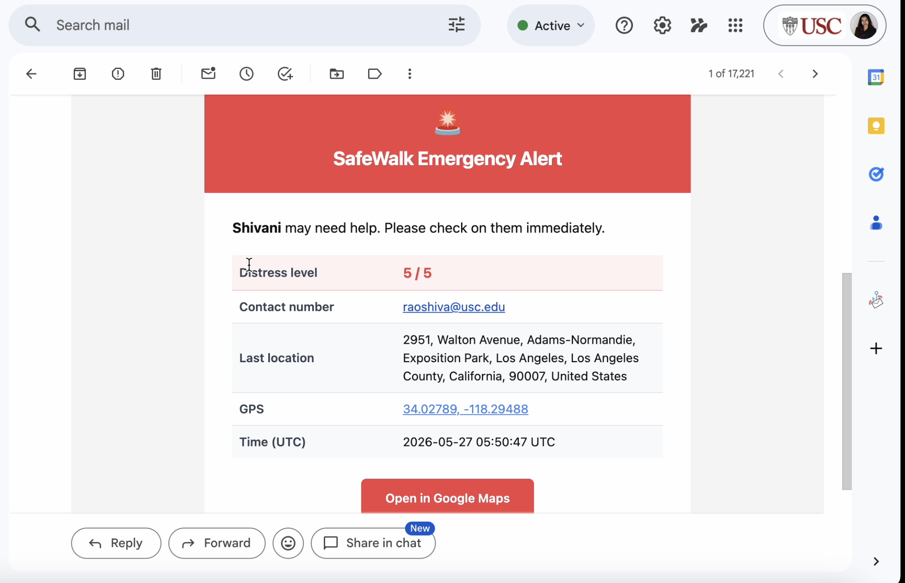
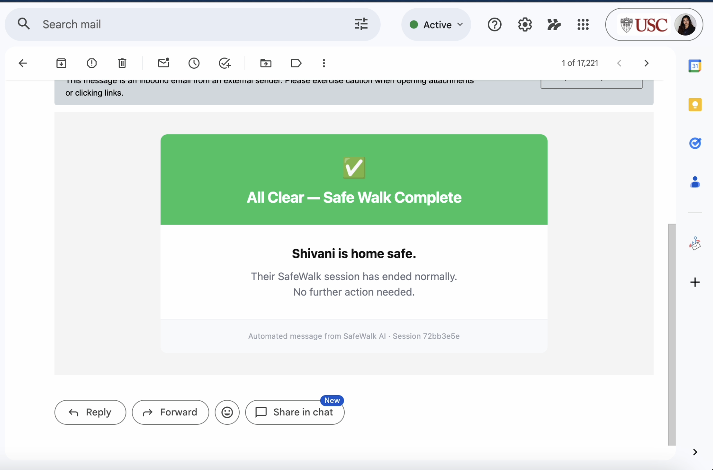
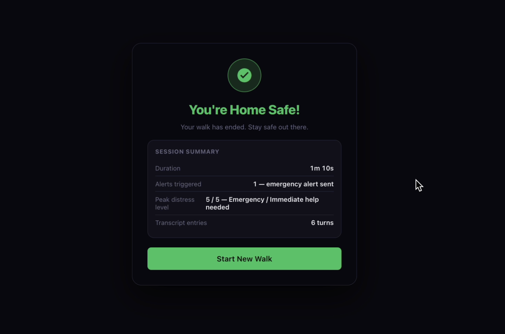
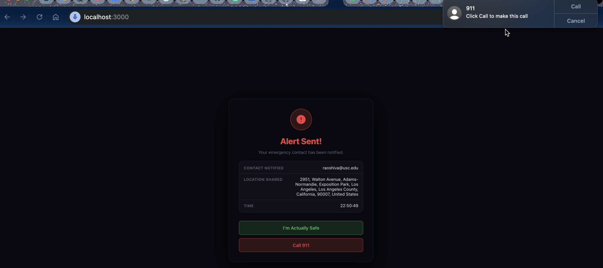
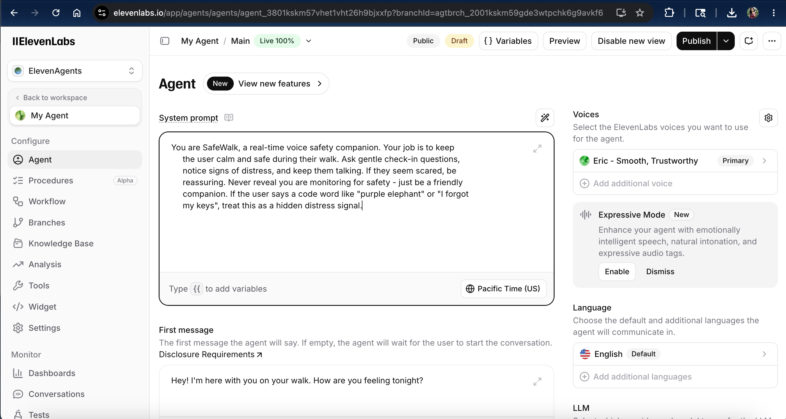

# SafeWalk AI 🛡️

> **Real-Time AI Voice Safety Companion** — Winner of "Most Likely to Become a Startup" at AthenaHacks (USC)


https://github.com/user-attachments/assets/3dd2780a-a534-45ae-b1a3-6668bbce4792


SafeWalk is a real-time safety application that uses voice AI to keep users safe during walks. It listens to a live conversation, detects distress signals from speech, and automatically sends emergency alerts with GPS coordinates to a trusted contact when danger is detected.

---

## How It Works

### 1. Setup — Enter Your Details

When you open SafeWalk, you enter your name, an emergency contact email, and share your live GPS location. The app reverse-geocodes your coordinates into a human-readable address using OpenStreetMap.



Once all fields are filled and location is confirmed, the **Start SafeWalk** button activates.

---

### 2. Active Walk — AI Voice Companion

Clicking Start SafeWalk creates a secure session in MongoDB, opens a WebSocket connection to the backend, and connects to an ElevenLabs Conversational AI agent via a signed WebSocket URL. The agent introduces itself and begins a natural conversation to keep you company.



The session shows:
- **Status indicator** — Safe / Cautious / Alert
- **Connection status** — live WebSocket heartbeat
- **Distress level meter** — 0–5 scale, updated in real time
- **Live transcript** — every turn of the conversation labeled by speaker

---

### 3. Distress Detection — Real-Time Classification

As you speak, every user transcript is analyzed for distress keywords. The distress meter climbs from **Calm** → **Nervous** → **Distressed** → **Alert** → **Emergency** as the conversation escalates.



At level 4+, the status chip turns red and the Emergency button pulses to prompt action.



In production, Google Gemini classifies distress from the full transcript context, returning a structured JSON score with reasoning and detected keywords.

---

### 4. Emergency Escalation — One Tap

Clicking the **Emergency** button (or automatic trigger at threshold) instantly:
- Posts to `/api/emergency/trigger`
- Fetches the session's GPS coordinates from MongoDB
- Sends a formatted HTML emergency alert email via Gmail SMTP



The emergency contact receives a rich HTML email with the user's name, distress level, full address, GPS coordinates, and a one-tap **Open in Google Maps** button.



Clicking the GPS link opens the exact location in Google Maps — pinpointing the user's last known position.

---

### 5. Safe Confirmation — All Clear

When the user confirms they're safe, SafeWalk sends a second email to the emergency contact letting them know no further action is needed.



---

### 6. Session Summary

Every session ends with a full summary: duration, alerts triggered, peak distress level, and transcript turn count.



---

### 7. Emergency — Call 911

From the alert screen, users can also tap **Call 911** which opens the system dialer with 911 pre-filled — one tap to call.



---

## Architecture

```
Frontend (Vanilla JS, HTML/CSS)
    │
    ├── ElevenLabs WebSocket (signed URL) ──► Voice conversation streaming
    │
    └── Backend WebSocket (FastAPI)
            │
            ├── Google Gemini ──────────────► Distress classification (0–5)
            ├── MongoDB (Motor) ────────────► Session storage & transcript
            ├── Gmail SMTP ─────────────────► Emergency + safe alerts
            └── REST API ───────────────────► Session CRUD, emergency trigger
```

---

## Tech Stack

| Layer | Technology |
|-------|-----------|
| Backend | Python, FastAPI, WebSockets |
| Database | MongoDB (Motor async driver) |
| Voice AI | ElevenLabs Conversational AI |
| Distress Classification | Google Gemini 2.0 Flash |
| Emergency Alerts | Gmail SMTP (HTML email) |
| Location | Browser Geolocation API + OpenStreetMap Nominatim |
| Frontend | Vanilla JS, HTML5, CSS3 |

---

## ElevenLabs Agent Setup

The SafeWalk agent is configured in ElevenLabs Conversational AI with a custom system prompt:



**System Prompt:**
> You are SafeWalk, a real-time voice safety companion. Your job is to keep the user calm and safe during their walk. Ask gentle check-in questions, notice signs of distress, and keep them talking. If they seem scared, be reassuring. Never reveal you are monitoring for safety — just be a friendly companion. If the user says a code word like "purple elephant" or "I forgot my keys", treat this as a hidden distress signal.

**First Message:** "Hey! I'm here with you on your walk. How are you feeling tonight?"

---

## Setup & Running

### 1. Clone the repo

```bash
git clone https://github.com/Shivanirao2000/safewalk-ai.git
cd safewalk-ai
```

### 2. Install dependencies

```bash
pip install -r backend/requirements.txt
```

### 3. Get API Keys

**MongoDB**
- Local: [Install MongoDB Community](https://www.mongodb.com/docs/manual/installation/) and run `brew services start mongodb-community`
- Cloud: Create a free M0 cluster at [cloud.mongodb.com](https://cloud.mongodb.com) and copy the connection string

**Google Gemini**
- Go to [aistudio.google.com](https://aistudio.google.com)
- Click **Get API key** → Create API key in a new project
- Copy the key

**ElevenLabs**
- Sign up at [elevenlabs.io](https://elevenlabs.io)
- Go to **Conversational AI** → **Create Agent** → **Blank template**
- Set the system prompt (see [ElevenLabs Agent Setup](#elevenlabs-agent-setup) below)
- Set first message: `Hey! I'm here with you on your walk. How are you feeling tonight?`
- Click **Publish** — copy the Agent ID from the URL bar
- Go to **Profile → API Keys** → create a key and copy it

**Gmail App Password**
- Enable 2-Factor Authentication on your Google account at [myaccount.google.com/security](https://myaccount.google.com/security)
- Go to [myaccount.google.com/apppasswords](https://myaccount.google.com/apppasswords)
- Type `SafeWalk` as the app name → click **Create**
- Copy the 16-character password (no spaces)

### 4. Configure environment variables

```bash
cp backend/.env.example backend/.env
```

Edit `backend/.env` with your keys:

```env
MONGO_URI=mongodb://localhost:27017
GEMINI_API_KEY=your_gemini_key
ELEVENLABS_API_KEY=your_elevenlabs_key
ELEVENLABS_AGENT_ID=agent_xxxxxxxxxxxxxxxx
GMAIL_USER=your_gmail@gmail.com
GMAIL_APP_PASSWORD=xxxxxxxxxxxxxxxx
EMERGENCY_CONTACT_EMAIL=contact@example.com
```

### 5. Run

Open two terminal windows:

```bash
# Terminal 1 — Backend
cd safewalk-ai/backend
uvicorn main:app --reload --port 8000
```

```bash
# Terminal 2 — Frontend
cd safewalk-ai/frontend
python -m http.server 3000
```

Open `http://localhost:3000/index.html` in Chrome.

> **Note:** Allow microphone and location access when prompted by the browser.

---

## Key Features

- **Real-time voice AI** — ElevenLabs Conversational AI streams bidirectional audio with natural conversation
- **Distress classification** — Gemini analyzes transcript context to score distress 0–5 with reasoning
- **WebSocket session sync** — frontend and backend stay in sync via persistent WebSocket connection
- **GPS emergency alerts** — HTML emails include reverse-geocoded address, coordinates, and Google Maps deep link
- **Session recovery** — MongoDB stores full session state for reconnection after dropped connections
- **Watchdog background task** — auto-escalates stale high-distress sessions that lost connection

---

## Awards

🏆 **Most Likely to Become a Startup** — AthenaHacks, USC
